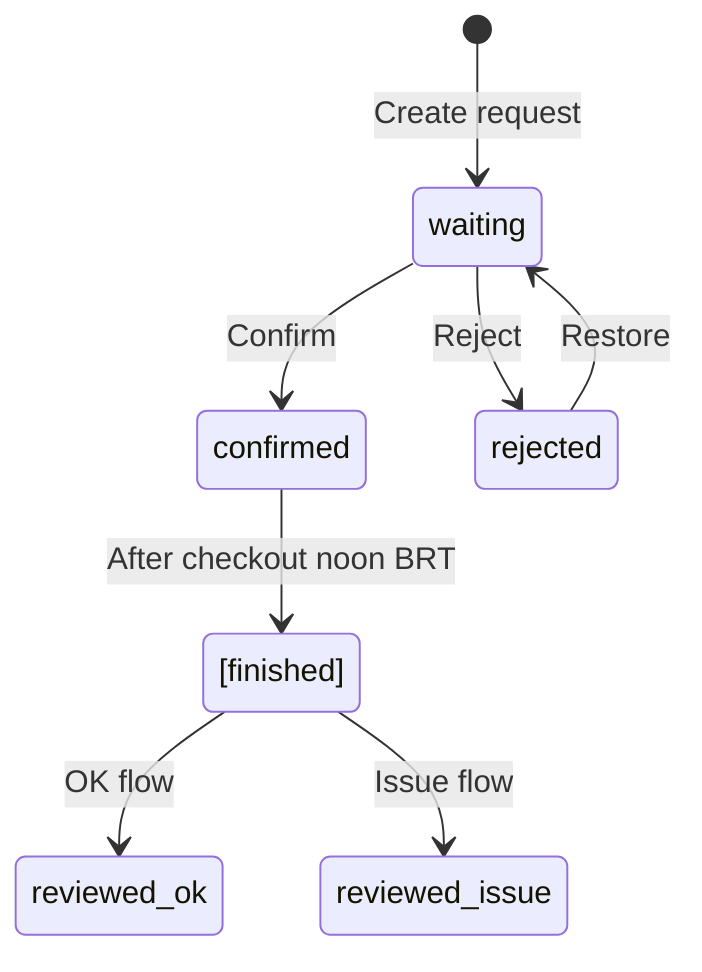
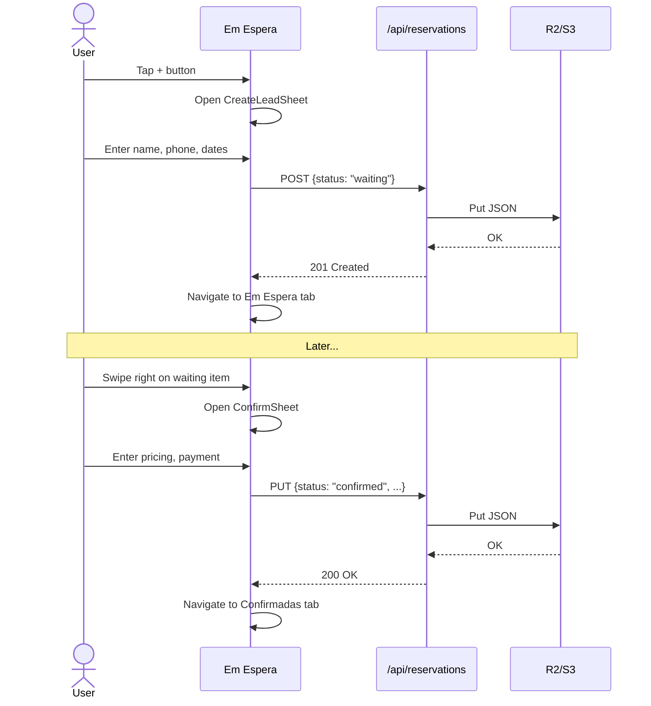
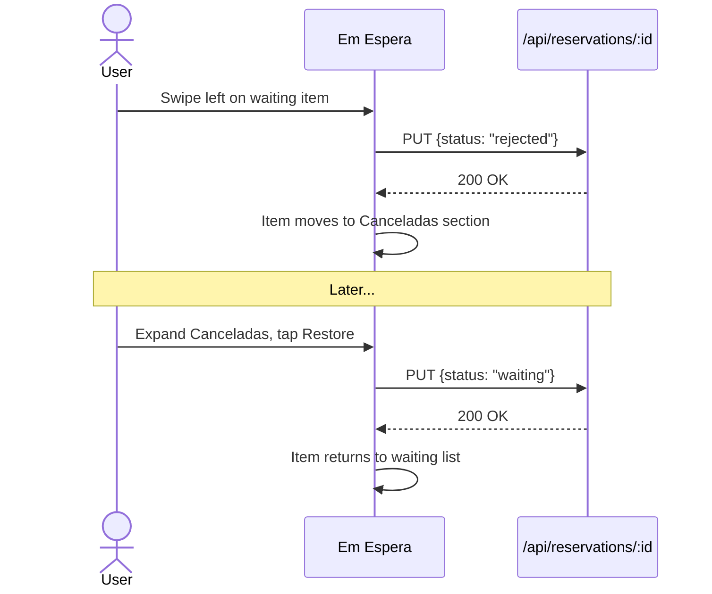
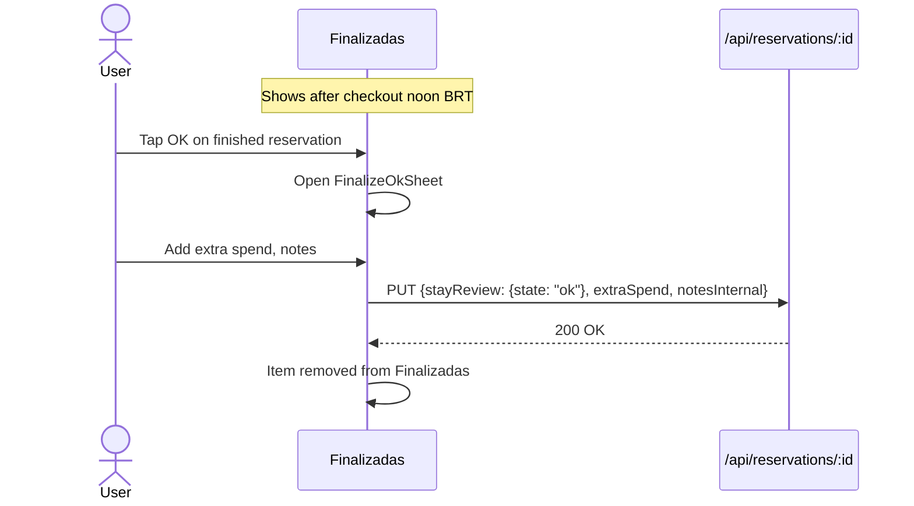
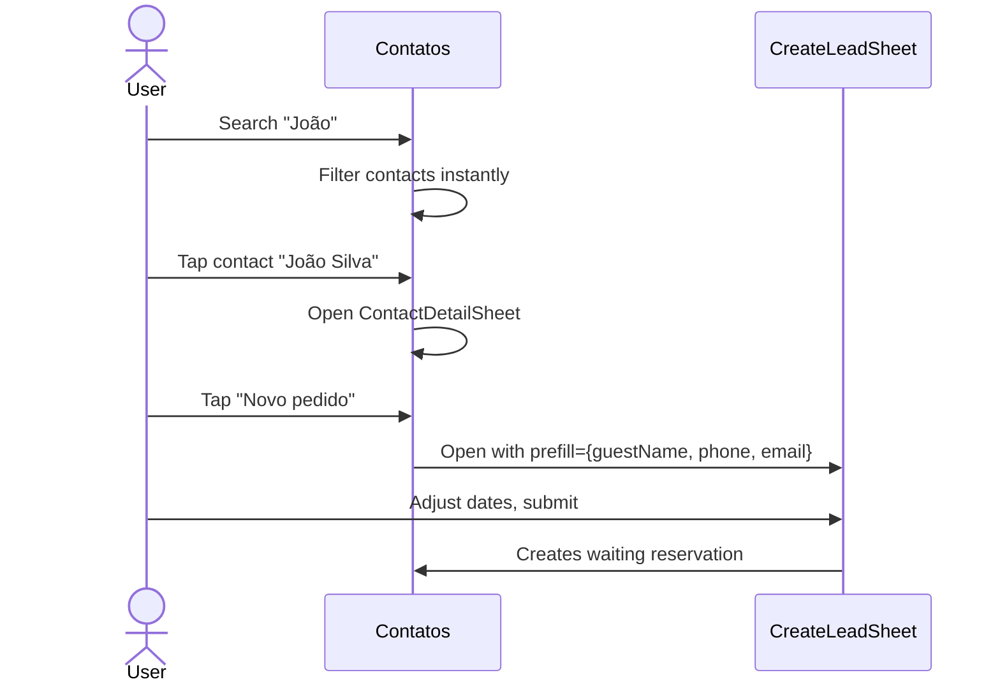
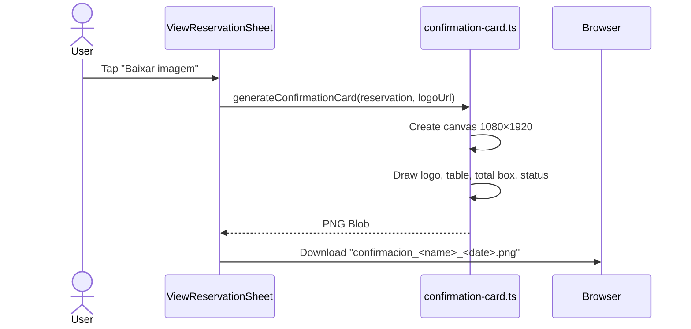

# Habitación — Reservation Manager

A mobile-first reservation management app designed for small guest room business—built to be fast, safe, and clear on any device.

[](./LICENSE)
[](#)
[](#)

> **Personal Project:** This app was built specifically for my mother to manage her family guest room. Access is intentionally restricted to a small allowlist of family members. The codebase is open-source for learning purposes, but the live instance is private.
>
> **Branding:** "Habitación Familiar de Lisiani y Airton"

---

## What This App Solves

Habitación replaces paper notebooks and spreadsheets for managing guest reservations:

- **Create requests instantly** — capture guest name and contact, decide later
- **Confirm when ready** — add dates, pricing, and payment info
- **Track payments** — multiple payments, partial deposits, any method
- **Review checkouts** — mark stays as OK or flag issues
- **Find past guests** — search contacts, create new bookings with prefilled info
- **Generate confirmation cards** — shareable PNG images for guests

**Key Principles:**
- Mobile-first (touch-optimized, bottom navigation)
- Fast (no page reloads, instant feedback)
- Safe (no destructive deletes, backup/restore built-in)
- Simple (one workflow: request → confirm → checkout → review)

---

## Core Features

### Confirmadas (Calendar + Upcoming)

The main view showing confirmed reservations:

- **Monthly calendar** with occupancy colors (1–4 rooms: yellow → orange → red)
- **Selected date list** showing reservations for tapped day
- **Upcoming list** (all future confirmed reservations)
- **Two-column desktop layout** (calendar left, upcoming right)

<div align="center">
  <table>
    <tr>
      <td>
        
      </td>
      <td>
        
      </td>
    </tr>
  </table>
</div

---

### Em Espera (Waiting Requests)

Manage pending booking requests:

- **Swipe right** → Confirm (opens ConfirmSheet with pricing)
- **Swipe left** → Reject (moves to Canceladas section)
- **Tap View** → Full reservation details
- **Canceladas toggle** — collapsed section of rejected items with restore option

<div align="center">
  
</div>

---

### Finalizadas (Finished Inbox)

Post-checkout review queue. Reservations appear here after **checkout noon BRT**:

- **OK flow** — Mark stay successful, optionally add extra spend + notes
- **Issue flow** — Flag problem with required reason (no-show, dispute, etc.)
- **Badge count** in bottom nav shows pending reviews

<div align="center">
  
</div>

---

### Contatos (Contacts)

Derived contact list from all reservations:

- **Search** by name, phone, or email (instant, no refetch)
- **Contact detail sheet** — stats (total/confirmed/waiting), reservation history
- **"Nova reserva"** — Create confirmed reservation with prefilled guest info
- **"Novo pedido"** — Create waiting request with prefilled guest info

<div align="center">
  
</div>

---

### Ferramentas (Tools)

Export, backup, restore, and settings:

- **Export CSV** — All reservations with 21+ columns, Excel-compatible
- **Export NDJSON** — Lossless backup (one JSON object per line)
- **Restore** — Upload NDJSON backup with dry-run preview
- **Theme toggle** — Light/dark mode

---

### View & Confirmation Card

Full reservation details with actions:

- **View sheet** — Guest info, dates, pricing, payments, notes
- **Download PNG** — 1080×1920 confirmation card in Spanish
- **Share** — Uses `navigator.share()` or fallback download
- **Edit** — Opens EditReservationSheet

The card includes:
- Centered logo (280px)
- Two-column table (labels left, values right)
- Green total box
- Status badge (Confirmada / En espera / Cancelada)


---

## Navigation & Routes

### Current Routes

| Route | Description |
|-------|-------------|
| `/` | Main v2 UI (ClientShellV2) — **canonical** |
| `/sign-in` | Google OAuth sign-in page |
| `/api/auth/*` | NextAuth handlers |
| `/api/reservations` | GET (list by month), POST (create) |
| `/api/reservations/:id` | GET, PUT, DELETE |
| `/api/backup/reservations.csv` | CSV export |
| `/api/backup/reservations.ndjson` | NDJSON export |
| `/api/backup/restore` | Upload NDJSON restore |

### Legacy Routes

- `/v2` — Originally separate route, now `/` defaults to v2 UI
- v1 ClientShell has been removed; all users see v2

---

## User Roles & Permissions

### Allowlist Model

Access is controlled by the `ALLOWED_EMAILS` environment variable:

```
ALLOWED_EMAILS=owner@example.com,staff@example.com
```

| User Type | Auth | Write Access | UI |
|-----------|------|--------------|-----|
| **Allowlisted (Admin)** | ✅ Google OAuth | ✅ Full CRUD | Full UI |
| **Non-allowlisted** | ✅ Google OAuth | ❌ Read-only | Demo mode with banner |

### Permission Enforcement

| Action | UI Behavior | API Behavior |
|--------|-------------|--------------|
| View reservations | ✅ Always visible | ✅ 200 OK |
| Create/Edit/Delete | Hidden + (button) in demo mode | 403 Forbidden |
| Export backup | ✅ Always available | ✅ 200 OK |
| Restore | Hidden in demo mode | 403 Forbidden |

### Demo Mode

Non-allowlisted users see a **read-only demo** with fixture data:
- Yellow banner: "Modo demonstração — somente leitura"
- Fixture: 24 realistic reservations
- All write operations disabled (UI) or return 403 (API)

Activate manually: `NEXT_PUBLIC_DEMO_MODE=1`

---

## Data Model & Semantics

### ReservationV2 Shape

```typescript
interface ReservationV2 {
  schemaVersion: 2;
  id: string;
  status: "confirmed" | "waiting" | "rejected";
  
  // Guest
  guestName: string;
  phone?: string;
  email?: string;
  partySize: number;
  rooms?: number;  // 1–4, affects occupancy colors
  
  // Dates
  checkIn: string;   // YYYY-MM-DD
  checkOut: string;  // YYYY-MM-DD
  
  // Pricing
  breakfastIncluded: boolean;
  nightlyRate: number;
  breakfastPerPersonPerNight: number;
  manualLodgingEnabled?: boolean;
  manualLodgingTotal?: number;
  extraSpend?: number;
  totalNights: number;
  totalPrice: number;
  
  // Payment
  payment: {
    deposit?: { due?: number; paid?: boolean };
    terms?: string;
    events?: PaymentEvent[];
  };
  
  // Notes
  notesInternal?: string;  // Staff-only
  notesGuest?: string;     // For/from guest
  
  // Review (post-checkout)
  stayReview?: {
    state: "pending" | "ok" | "issue";
    reviewedAt?: string;
    note?: string;
  };
  
  // Metadata
  createdAt: string;
  updatedAt: string;
  _importMeta?: { normalizedFrom?: 1; normalizedAt?: string; unknownKeys?: string[] };
}
```

### Status Lifecycle



### Rooms & Occupancy

The `rooms` field (1–4) determines calendar cell colors:

| Total Rooms Booked | Color |
|-------------------|-------|
| 1 | Yellow |
| 2 | Orange |
| 3 | Red |
| 4 | Deep red (full) |

### Payments

Payment tracking uses the `payment.events[]` array:

```typescript
interface PaymentEvent {
  id?: string;      // UUID for deletion
  amount: number;
  date: string;     // ISO 8601
  method?: string;  // Pix, Dinheiro, Cartão, Outro
  note?: string;
}
```

**Legacy v1 deposit migration:**
- If v1 record has `depositPaid=true` and `depositDue > 0`:
  - Creates event with note "Sinal pago"
  - Deterministic ID: `legacy-deposit:<recordId>` (no duplicates on re-normalize)

**Editing payments:**
- Add: Appends new event with auto-generated UUID
- Remove: Filters out event by ID

### Notes

- `notesInternal` — Staff-only notes (migrated from v1 `notes`)
- `notesGuest` — Notes intended for the guest

### stayReview (Finalization)

After checkout noon BRT, confirmed reservations appear in Finalizadas:

- `state: "pending"` — Awaiting review (default)
- `state: "ok"` — Marked successful (can add extra spend + notes)
- `state: "issue"` — Problem flagged (reason required)

### Unknown Key Preservation

The data layer preserves unknown fields through all operations:
- Normalization tracks unknown keys in `_importMeta.unknownKeys`
- Restore writes raw objects without stripping
- Updates spread existing record first

---

## Key Workflows

### Create → Confirm → Appears in Confirmadas



### Reject → Restore



### Finalized Reservation → OK/Issue



### Contact → New Reservation



### Confirmation Card Export



---

## Timezone & Calendar Correctness

### Local Date Parsing

Dates are parsed without UTC shift to avoid timezone issues:

```typescript
// BAD: May shift to wrong day in negative timezones
new Date("2026-02-17")  // Could become Feb 16 at 21:00

// GOOD: Uses local timezone
parseDateString("2026-02-17")  // new Date(2026, 1, 17)
```

### Monday-First Calendar

The calendar grid uses Monday as the first day of the week (Portuguese standard):

```
Seg  Ter  Qua  Qui  Sex  Sáb  Dom
 1    2    3    4    5    6    7
```

Grid math: `(date.getDay() + 6) % 7` gives Monday = 0, Sunday = 6.

### Checkout Noon BRT Rule

Reservations appear in Finalizadas after **12:00 BRT** on the checkout date:

```typescript
function isAfterCheckoutNoonBRT(checkOut: string): boolean {
  const noon = new Date(`${checkOut}T12:00:00-03:00`);
  return new Date() > noon;
}
```

---

## Exports, Backups, Restore

### Export Formats

| Format | Content-Type | Use Case |
|--------|--------------|----------|
| CSV | `text/csv` | Spreadsheet analysis, human-readable |
| NDJSON | `application/x-ndjson` | Lossless backup, machine restore |

**CSV includes:** 21+ columns covering all v1 fields, UTF-8 BOM for Excel compatibility.

**NDJSON:** One JSON object per line, preserves all fields including unknown keys.

Filename pattern: `reservations_backup_<userId>_<YYYYMMDD_HHMMSS>.{csv,ndjson}`

### Restore Behavior

1. **Upload** NDJSON file via Ferramentas
2. **Dry-run** (default) — Preview counts, conflicts, no writes
3. **Create-only** — Write new records, skip existing
4. **Overwrite** — Replace existing (requires typing "OVERWRITE")

**Safety features:**
- 10MB file size limit
- ID validation (rejects `/`, `..`, spaces)
- Duplicate IDs: last occurrence wins
- Sandbox prefix option for testing

### v1 → v2 Normalization

Existing v1 records are **automatically normalized** when:
- Exported (NDJSON)
- Restored
- Read by v2 data layer

Normalization rules:
- `schemaVersion` → set to `2`
- `status` → default `"confirmed"`
- `depositDue/depositPaid` → move to `payment.deposit`
- `notes` → move to `notesInternal`
- v1 paid deposits → create payment event with "Sinal pago"

**No destructive migration:** Production data in S3/R2 is NOT modified. Normalization happens on read/export.

---

## Development

### Requirements

- Node.js 18+
- npm
- Google OAuth credentials
- Cloudflare R2 bucket (or S3-compatible)

### Install & Run

```bash
npm install
npm run dev      # http://localhost:3000
```

### Build & Production

```bash
npm run build    # Compile for production
npm start        # Run production server
```

### Test

```bash
npm test         # Run all unit tests (229+)
```

### Lint

```bash
npm run lint     # ESLint with Next.js config
```

### Environment Variables

```env
# NextAuth
NEXTAUTH_URL=http://localhost:3000
NEXTAUTH_SECRET=<32+ character secret>

# Google OAuth
GOOGLE_CLIENT_ID=<from Google Cloud Console>
GOOGLE_CLIENT_SECRET=<from Google Cloud Console>

# Storage (Cloudflare R2)
STORAGE_PROVIDER=R2
BUCKET_NAME=<your-bucket>
CF_R2_ACCOUNT_ID=<account-id>
CF_R2_ACCESS_KEY_ID=<access-key>
CF_R2_SECRET_ACCESS_KEY=<secret-key>

# Access Control
ALLOWED_EMAILS=owner@example.com,staff@example.com

# Optional: Demo Mode
NEXT_PUBLIC_DEMO_MODE=1
```

### Project Structure

```
app/
├── components/v2/       # V2 UI components (18 files)
│   ├── ClientShellV2.tsx    # Main shell with state management
│   ├── BottomNav.tsx        # 5-tab navigation
│   ├── ConfirmadasPage.tsx  # Calendar + upcoming
│   ├── EmEsperaPage.tsx     # Waiting list + swipe
│   ├── FinalizadasPage.tsx  # Post-checkout review
│   ├── ContatosPage.tsx     # Contact search
│   ├── FerramentasPage.tsx  # Tools/settings
│   └── *Sheet.tsx           # Bottom sheet modals
├── api/
│   ├── auth/[...nextauth]/  # NextAuth handler
│   ├── reservations/        # CRUD endpoints
│   └── backup/              # Export/restore endpoints
├── hooks/useIsMobile.ts     # Mobile detection
└── page.tsx                 # Entry point (→ ClientShellV2)

core/
├── entities.ts              # V1 type (legacy)
├── entities_v2.ts           # V2 types (current)
└── usecases.ts              # Business logic

lib/
├── data/v2.ts               # V2 data access layer
├── normalize.ts             # V1→V2 normalization
├── confirmation-card.ts     # PNG card generator
├── calendar-utils.ts        # Date/grid utilities
├── contacts.ts              # Contact derivation
├── finished-utils.ts        # Checkout/review logic
├── backup.ts                # CSV/NDJSON export
├── restore.ts               # NDJSON restore
├── s3.ts                    # S3/R2 storage gateway
├── allowlist.ts             # Email permission check
└── *.test.ts                # Unit tests (229+)
```

---

## Screenshots & Demo Materials

> **To add screenshots/videos:** Edit this README on GitHub web, drag and drop images directly into the editor. GitHub will upload them and insert the correct markdown.

### Screenshots to Add

**Confirmadas - 1** — Calendar with occupancy colors
<div align="center">
  
</div


**Confirmadas - 2** — Upcoming reservations
<div align="center">
  
</div>


**Em Espera** — Swipe to confirm/reject
<div align="center">
  
</div>

**Finalizadas** — Post-checkout review
<div align="center">
  
</div>

**Contatos** — Search and contact details
<div align="center">
  
</div>

**Confirmation Card** — Generated PNG for guest


### Screen Recordings


https://github.com/user-attachments/assets/5a6b9208-0f6f-4b92-a1dc-c3fdc8c6a715


---

## License

GNU GENERAL PUBLIC LICENSE v3.0 — see [LICENSE](./LICENSE).
