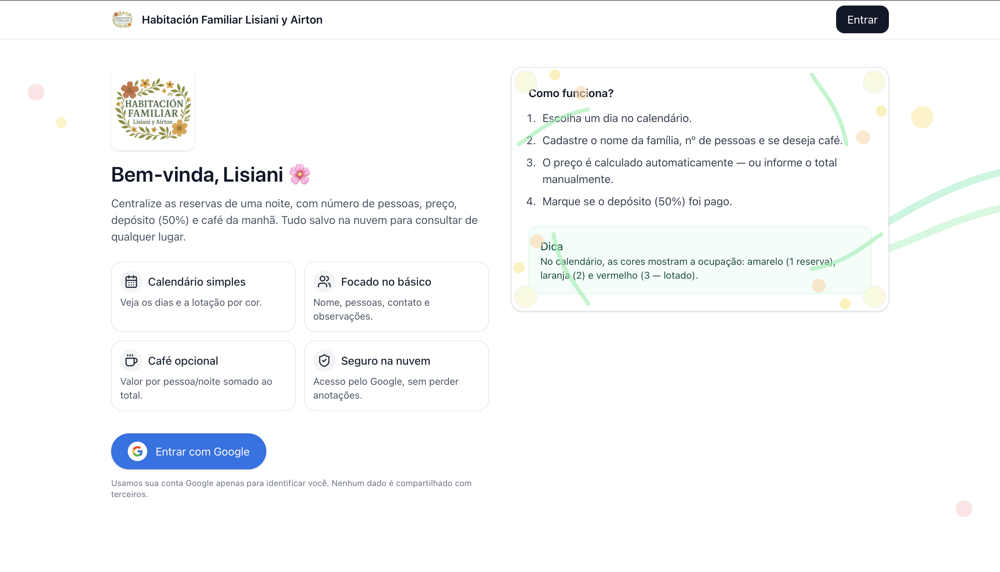
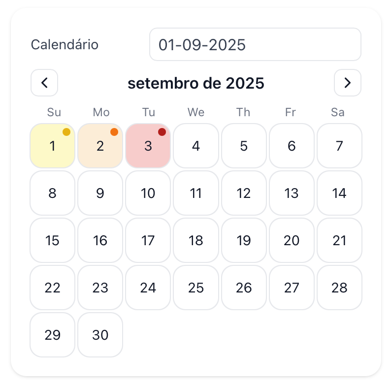
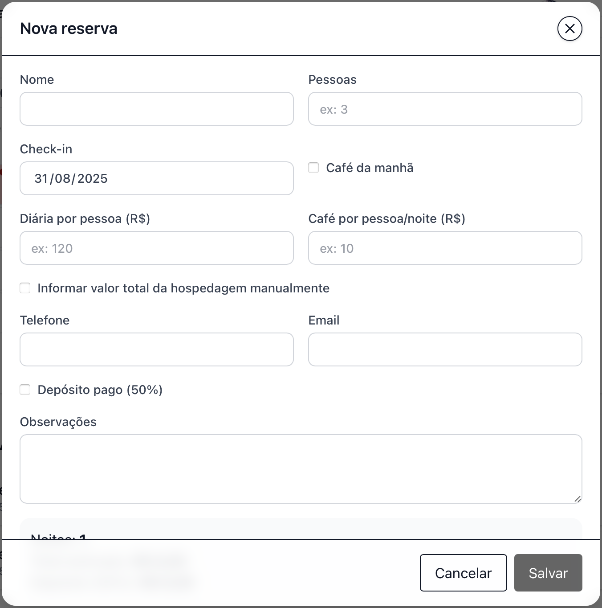
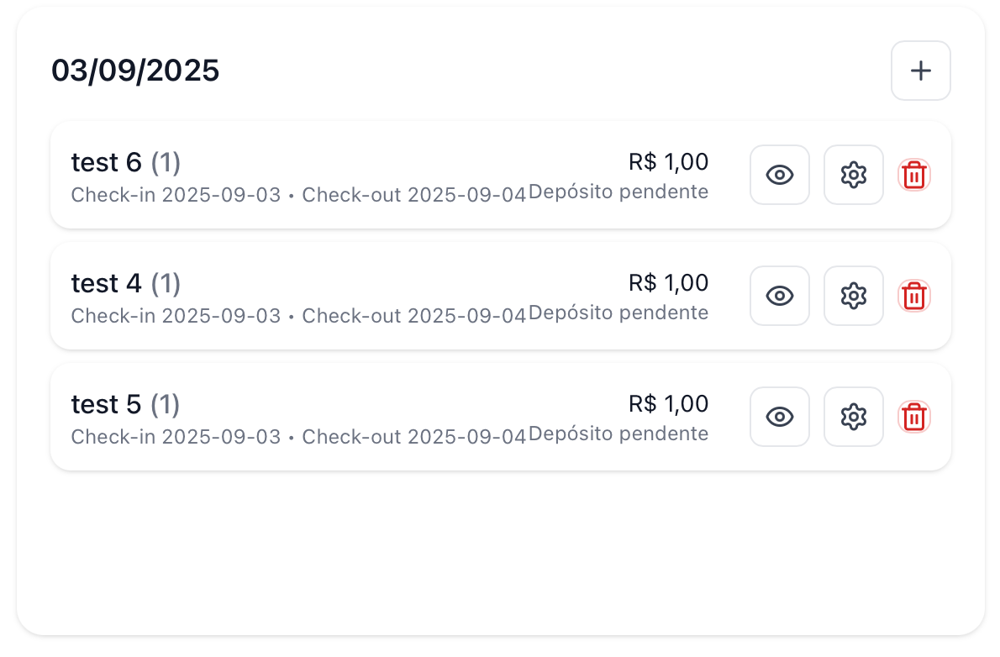
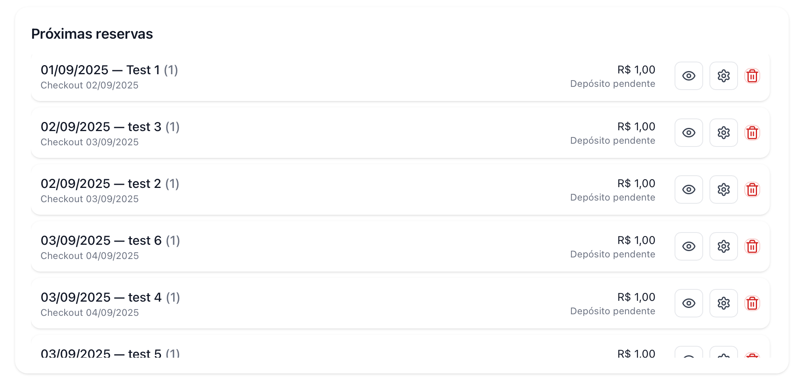

# Habitación Familiar — Reservation Manager

A minimalist, single‑purpose app to register **one‑night** reservations for a family guest room — built to be fast, clear, and safe for non‑technical users.

[](./LICENSE)
[](#)
[](#)

> UI branding: **“Habitación Familiar de Lisiani y Airton.”**  
> **Access control:** Authentication is open to all Google accounts, but authorization to create [items] is restricted to an **allowlist**." 

> **Live Demo:** replace this link with your Vercel URL: `https://habitation-management.vercel.app`

---

## Features (current)
- **One‑step reservation:** guest name, party size, **check‑in (always 1 night)**, optional breakfast, contacts, notes.
- **Automatic pricing** *or* **manual lodging total** (for discounts).
- **Deposit (50%)** with **paid / pending** status.
- **Calendar with occupancy colors** (max 3 rooms):
  - 1 reservation → pastel yellow; 2 → mellow orange; 3 → deep red (full).
- **Day view** with all reservations and actions (👁 view, ⚙ edit, 🗑️ delete with confirmation).
- **Upcoming list** from today onward (scroll if long).
- **View / Edit never overlap:** prompts to save/discard changes before switching.

---

## ⚡ Quick Start
1. **Sign in with Google**. Access is limited to allowlisted emails.
2. **Pick a date** on the calendar.
3. **Fill guest details** — name, party size, optional breakfast, phone/email, notes.
4. Choose **automatic** or **manual** lodging total.
5. Set **deposit (50%)** as paid or pending.
6. **Save** — the reservation appears in the **Day view** and the **Upcoming** list.

---

## Screenshots

**Onboarding & sign‑in**
<br/>


**Calendar with occupancy colors**
<br/>


**Create a new reservation**
<br/>


**Day view / reservation list**
<br/>


**Reservation details modal**
<br/>


**Upcoming reservations list**
<br/>


---

## Tech highlights
- **Next.js 14 (App Router)** — file‑based API routes for CRUD.
- **React 18 + TypeScript** — strict types across domain helpers and UI.
- **NextAuth (Google)** — per‑user data isolation; each account only accesses its own reservations.
- **Cloudflare R2 (S3‑compatible)** — simple storage: one **JSON per reservation**.
- **Zod validation** — schema‑validated inputs on both client and server.
- **Pure pricing helpers** — deterministic functions enable straightforward unit tests.

---

## 🔐 Security model
- **Sign‑in allowlist**: only emails listed in `ALLOWED_EMAILS` can authenticate.
- **Per‑user isolation**: reservations are namespaced by `userId`; users only see their own data.
- **Private bucket**: no public listing; access via scoped keys.

> No **admin key** is required anywhere in the UI; access is controlled by the Google account allowlist.

---

## Project structure

```
.
├── app
│   ├── (ui)
│   │   └── ClientShell.tsx
│   ├── api
│   │   ├── auth
│   │   │   └── [...nextauth]
│   │   │       └── route.ts
│   │   └── reservations
│   │       ├── [id]
│   │       │   ├── ics
│   │       │   │   └── route.ts
│   │       │   └── route.ts
│   │       └── route.ts
│   ├── components
│   │   ├── AddReservationModal.tsx
│   │   ├── CalendarBoard.tsx
│   │   ├── Navbar.tsx
│   │   └── ReservationEditor.tsx
│   ├── layout.tsx
│   ├── page.tsx
│   └── sign-in
│       └── page.tsx
├── core
│   ├── entities.ts
│   └── usecases.ts
├── lib
│   ├── admin.ts
│   ├── allowlist.ts
│   ├── auth.client.tsx
│   ├── auth.config.ts
│   ├── pricing.ts
│   ├── s3.ts
│   ├── schema.ts
│   └── user.ts
├── next-env.d.ts
├── next.config.js
├── package-lock.json
├── package.json
├── postcss.config.js
├── public
│   └── icons
├── tailwind.config.ts
├── tsconfig.json
└── utils
    └── ics.ts
```

---

## Data model

```ts
type ReservationItem = {
  id?: string
  guestName: string
  phone?: string
  email?: string
  partySize: number
  checkIn: string
  checkOut?: string
  breakfastIncluded: boolean
  nightlyRate: number
  breakfastPerPersonPerNight: number
  manualLodgingEnabled?: boolean
  manualLodgingTotal?: number
  depositPaid: boolean
  notes?: string
}
```

---

## Pricing rules

**Automatic**
```text
lodging = nights * (nightlyPerPerson * partySize)
breakfast = breakfastIncluded ? nights * partySize * breakfastPerPersonPerNight : 0
total = lodging + breakfast
deposit = 0.5 * total
```

**Manual lodging enabled**
```text
lodging = manualLodgingTotal
breakfast = breakfastIncluded ? nights * partySize * breakfastPerPersonPerNight : 0
total = lodging + breakfast
deposit = 0.5 * total
```

- `nights = checkOut - checkIn` (days). In v1: **check‑out = check‑in + 1 day**.
- UI language & currency: **pt‑BR**, **BRL**.

---

## Run locally

```bash
npm i
npm run dev        # http://localhost:3000
# production mode
npm run build && npm start
```

---

## Deploy (Vercel)

1. Import the GitHub repository into **Vercel** (framework preset: *Next.js*).
2. Add **Environment Variables** (see next section).
3. Deploy.
4. Add your Vercel domain to Google OAuth (origins + redirect URI).

---

## Google OAuth setup

**Google Cloud Console → APIs & Services → Credentials**

- **Authorized JavaScript origins**
  - `http://localhost:3000`
  - `https://<your-project>.vercel.app`
- **Authorized redirect URIs**
  - `http://localhost:3000/api/auth/callback/google`
  - `https://<your-project>.vercel.app/api/auth/callback/google`

---

## Environment variables

```env
# NextAuth
NEXTAUTH_URL=http://localhost:3000
NEXTAUTH_SECRET=<dev-secret-32+chars>

GOOGLE_CLIENT_ID=<google-oauth-client-id>
GOOGLE_CLIENT_SECRET=<google-oauth-client-secret>

# Storage (R2 recommended)
STORAGE_PROVIDER=R2
BUCKET_NAME=<bucket>
CF_R2_ACCOUNT_ID=<id>
CF_R2_ACCESS_KEY_ID=<key>
CF_R2_SECRET_ACCESS_KEY=<secret>

# App access control
ALLOWED_EMAILS=mom@example.com,dad@example.com,me@gmail.com
# or
ALLOWED_DOMAIN=familia.com
```

---

## API endpoints

- `GET /api/reservations?month=YYYY-MM` — list reservations for a month.
- `POST /api/reservations` — create (requires a valid signed-in session).  
- `PUT /api/reservations/:id` — update (requires a valid signed-in session).  
- `DELETE /api/reservations/:id` — delete (requires a valid signed-in session).  

### Example

```bash
# Create
curl -s -X POST https://<domain>/api/reservations \  -H "Content-Type: application/json" \  --cookie "next-auth.session-token=<SESSION_TOKEN>" \  -d '{
    "guestName": "Familia Souza",
    "partySize": 3,
    "checkIn": "2025-09-01",
    "checkOut": "2025-09-02",
    "breakfastIncluded": true,
    "nightlyRate": 60,
    "breakfastPerPersonPerNight": 10
  }'
```

---

## Troubleshooting

- **“Invalid Compact JWE”** → set `NEXTAUTH_SECRET`.
- **Avatar blocked** → add Google avatar hosts to `next.config.js` (see below).
- **401 Unauthorized** → you’re not signed in or not allowlisted.
- **403 Forbidden** → email not in `ALLOWED_EMAILS` / `ALLOWED_DOMAIN`.
- **403 / 404 storage** → bucket name or IAM policy incorrect.
- **Google OAuth error** → production origins/redirects not added.

### `next.config.js` (Google avatars)
```js
module.exports = {
  images: {
    domains: [
      'lh3.googleusercontent.com',
      'lh4.googleusercontent.com',
      'lh5.googleusercontent.com'
    ],
  },
};
```

---

## Roadmap (planned)

- **Download per-reservation `.ics` event** (to sync with Google/Apple/Outlook).  
- Multi‑night reservations (date ranges).
- CSV export & monthly totals.
- Calendar feed for month (`/calendar.ics`).
- Share data between Google accounts.
- PWA (offline / installable).

---

## License

GNU GENERAL PUBLIC LICENSE — see `LICENSE`.
